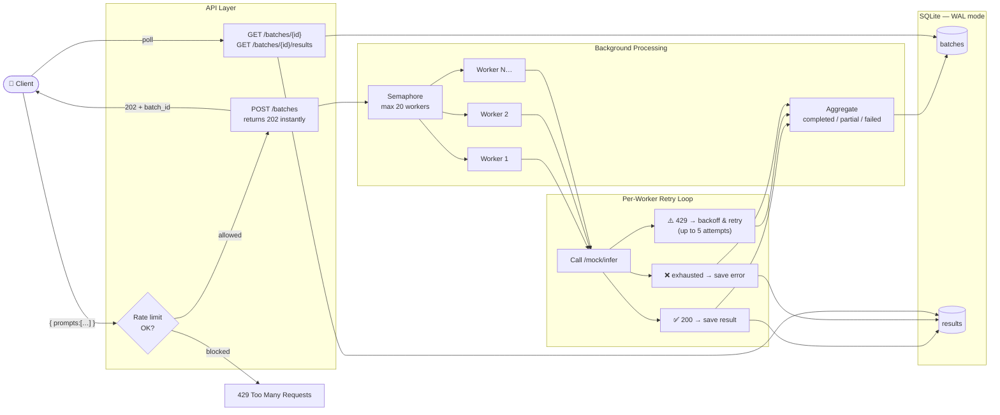

# Batch Inference Engine

A production-grade FastAPI service that accepts a batch of AI prompts, processes them concurrently against a mock rate-limited inference endpoint, and aggregates results in SQLite.

---

## Architecture



### How it works — 5 steps

| Step | What happens |
|------|-------------|
| **1. Accept** | Request validated → batch row created → `202 + batch_id` returned immediately, no waiting |
| **2. Fan-out** | Background task fans every prompt out to a worker pool bounded by `asyncio.Semaphore(MAX_WORKERS)` |
| **3. Retry loop** | Each worker calls the inference endpoint. On `429` it sleeps `BASE_BACKOFF × 2^attempt + jitter` and retries (up to `MAX_RETRIES` times) |
| **4. Persist** | Success → result row saved + `completed` counter ticked. Exhausted retries → error row saved + `failed` counter ticked |
| **5. Aggregate** | After all workers finish, one atomic SQL statement sets the final status: `completed` if all passed, `partial` if some failed, `failed` if the engine itself crashed |

---

## Features

- Accepts up to 1,000 prompts via JSON body or file upload
- Returns a `batch_id` immediately (HTTP 202) — processing runs in the background
- Bounded concurrency via `asyncio.Semaphore` (configurable worker count)
- Automatic retry with exponential backoff + jitter on `429` and timeouts
- Per-IP rate limiting on `POST /batches` (10 req/min, configurable)
- Results persisted to SQLite with WAL mode for concurrent writes
- Atomic final-status update to prevent race conditions
- Structured JSON logging on every request and worker event
- 29-test suite across unit and integration layers, with coverage reporting

---

## Setup

```bash
# Install uv
curl -LsSf https://astral.sh/uv/install.sh | sh

# Install dependencies
uv sync --group dev

# Activate virtualenv (optional — uv run works without it)
source .venv/bin/activate
```

## Run

```bash
uv run uvicorn app.main:app --reload --port 8000
```

Interactive docs are available at [http://localhost:8000/docs](http://localhost:8000/docs) once the server is running.

---

## API

| Method | Path | Description |
|--------|------|-------------|
| `POST` | `/batches` | Submit a batch (JSON or file upload) |
| `GET`  | `/batches/{id}` | Poll batch status and progress |
| `GET`  | `/batches/{id}/results` | Fetch results (paginated, filterable by status) |
| `GET`  | `/health` | Liveness + DB reachability check |
| `POST` | `/mock/infer` | Built-in mock inference endpoint |

### Submit via JSON

```bash
curl -X POST http://localhost:8000/batches \
  -H "Content-Type: application/json" \
  -d '{"prompts": ["What is Python?", "Explain async/await"]}'
```

```json
{
  "batch_id": "3fa85f64-...",
  "status": "accepted",
  "total": 2
}
```

### Submit via file

```bash
echo '["prompt one", "prompt two", "prompt three"]' > prompts.json

curl -X POST http://localhost:8000/batches \
  -F "file=@prompts.json"
```

### Poll status

```bash
curl http://localhost:8000/batches/<batch_id>
```

```json
{
  "batch_id": "3fa85f64-...",
  "status": "processing",
  "total": 100,
  "completed": 57,
  "failed": 3,
  "created_at": "2026-06-27T10:00:00+00:00",
  "finished_at": null
}
```

Possible `status` values: `accepted` → `processing` → `completed` / `partial` / `failed`

### Fetch results (paginated)

```bash
# First page
curl "http://localhost:8000/batches/<batch_id>/results?limit=100&offset=0"

# Only failures
curl "http://localhost:8000/batches/<batch_id>/results?status=failed"
```

---

## Configuration

All settings can be overridden via environment variables or a `.env` file:

| Variable | Default | Description |
|----------|---------|-------------|
| `MAX_WORKERS` | `20` | Max concurrent inference calls |
| `MAX_RETRIES` | `5` | Retry attempts per prompt |
| `BASE_BACKOFF` | `1.0` | Base backoff in seconds (doubles each retry) |
| `MOCK_RATE_LIMIT_PCT` | `0.20` | Fraction of mock calls that return 429 |
| `MOCK_INFERENCE_URL` | `http://localhost:8000/mock/infer` | Inference endpoint URL |
| `DB_PATH` | `batches.db` | SQLite database file path |
| `LOG_LEVEL` | `INFO` | Logging level |
| `MAX_PROMPTS` | `1000` | Max prompts per batch |
| `MAX_FILE_SIZE_MB` | `10` | Max upload file size |
| `RATE_LIMIT` | `10/minute` | `POST /batches` rate limit per client IP |

---

## Tests

```bash
# Run all tests
uv run pytest -v

# Run with coverage
uv run pytest --cov=app --cov-report=term-missing -v
```

The test suite covers:
- Database CRUD and status transitions
- Worker retry logic (429, timeout, 500, max retries exceeded)
- Engine concurrency and semaphore bounding
- Route validation, pagination, and error handling
- Rate limit enforcement (429 response with correct error envelope)

---

## Project structure

```
app/
├── main.py              # FastAPI app wiring (lifespan, middleware, handlers)
├── config.py            # Pydantic-settings, reads from env / .env
├── limiter.py           # slowapi Limiter singleton (avoids circular imports)
├── logger.py            # JSON formatter + setup_logging()
├── exceptions.py        # Custom exception types
├── error_handlers.py    # FastAPI exception → JSON response mapping
├── middleware.py        # Request logging middleware (request_id, duration)
├── database.py          # aiosqlite CRUD, init_db, WAL mode
├── schemas.py           # Pydantic request / response models
├── mock_api.py          # Mock inference endpoint (429 injection)
├── worker.py            # Single-prompt retry loop
├── routers/
│   ├── batches.py       # POST /batches, GET /batches/{id}, GET /batches/{id}/results
│   └── system.py        # GET /health
└── services/
    └── engine.py        # Semaphore + asyncio.gather orchestration
tests/
├── conftest.py          # Fixtures: temp DB, async client, fast backoff
├── test_database.py     # DB layer unit tests
├── test_worker.py       # Worker + retry unit tests (respx mocks)
├── test_engine.py       # Engine integration tests
└── test_routes.py       # Route-level integration tests
```
